IP Addresses:
 C9800-CL = 10.92.1.12
 WinServer22 (RADIUS) = 10.92.1.8
 
 
 

## Setup L3 Switch

~~~
!@CSwitch
conf t
 hostname CSwitch-92
 enable secret pass
 service password-encryption
 no logging console
 no ip domain lookup
 line cons 0
  password pass
  no login
  exec-timeout 0 0
  logging synchronous
 line vty 0 14
  password pass
  login
  exec-timeout 0 0
 !
 !
 vlan 10
  name WIRELESS
  exit
 int vlan 1
  ip add 10.92.1.4 255.255.255.0
  no shut
 int vlan 10
  ip add 10.92.10.4 255.255.255.0
  no shut
 !
 !
 int fa0/1
  switchport trunk encaps dot1q
  switchport mode trunk
  switchport trunk allowed vlan 1,10
  switchport trunk native vlan 1
 int range fa0/2,fa0/4
  switchport mode access
  switchport access vlan 10
  exit
 !
 !
 ip routing
 !
 !
 ip dhcp excluded-address 10.92.1.1 10.92.1.100
 ip dhcp excluded-address 10.92.10.1 10.92.10.100
 ip dhcp pool POOLDATA
  network 10.92.1.0 255.255.255.0
  default-router 10.92.1.4 255.255.255.0
  dns-server 10.92.1.10
  domain-name MGMTDATA.COM
 ip dhcp pool POOLWIFI
  network 10.92.10.0 255.255.255.0
  default-router 10.92.10.4 255.255.255.0
  dns-server 10.92.1.10
  domain-name WIFIDATA.COM 
  option 43 ip 10.92.1.12
  end
~~~

 
 

---
&nbsp;

## Setup C9800-Cloud

### 1. Open the VM: C9800-CL-universalk9_vga.17.15.03.ovf

&nbsp;
---
&nbsp;

### 2. Set the Name

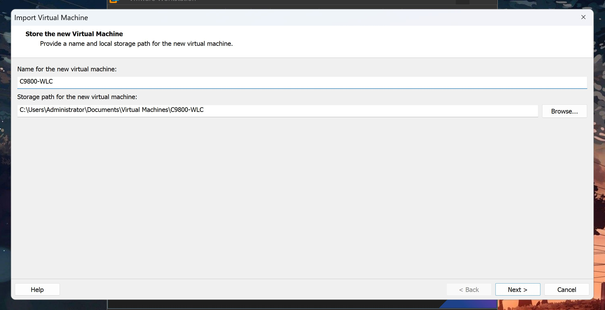

&nbsp;
---
&nbsp;

### 3. Specify deployment size to the minimum __100 APs, 1k Clients__ 

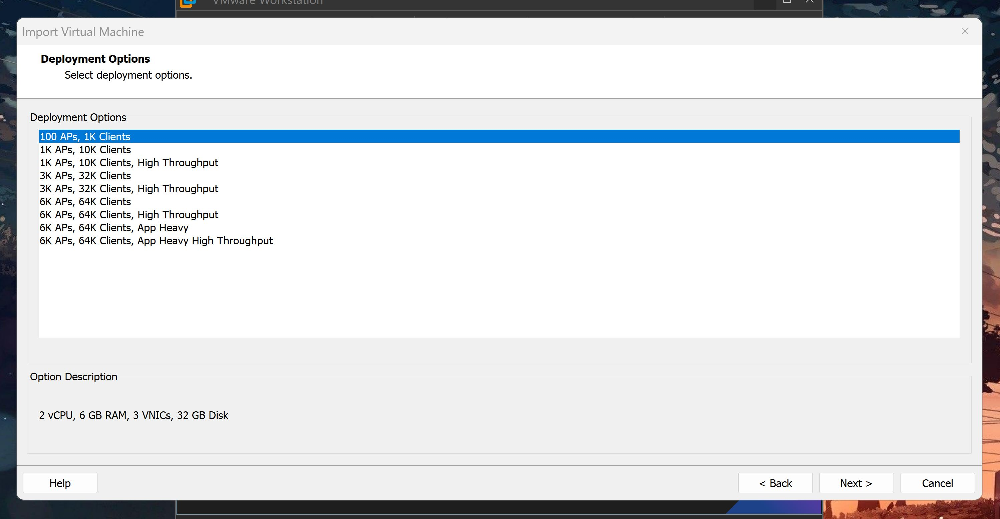

&nbsp;
---
&nbsp;

### 4. Leave everything as default and simply __Import__

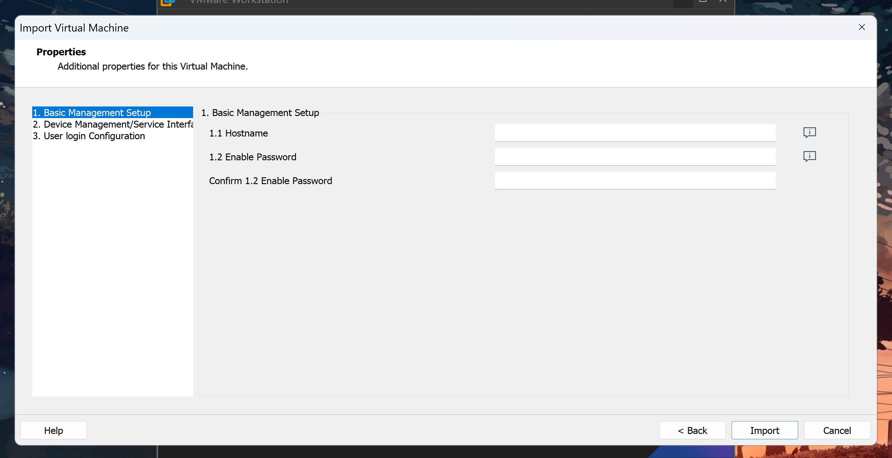

&nbsp;
---
&nbsp;

### 5. Set the Network Adapters to the following:
| Network Adapter | Connection              |
| ---             | ---                     |
| Network Adapter | __NAT__                 |
| NetAdapter 2    | __Bridged (Replicate)__ |
| NetAdapter 3    | __VMNet3__              |

 

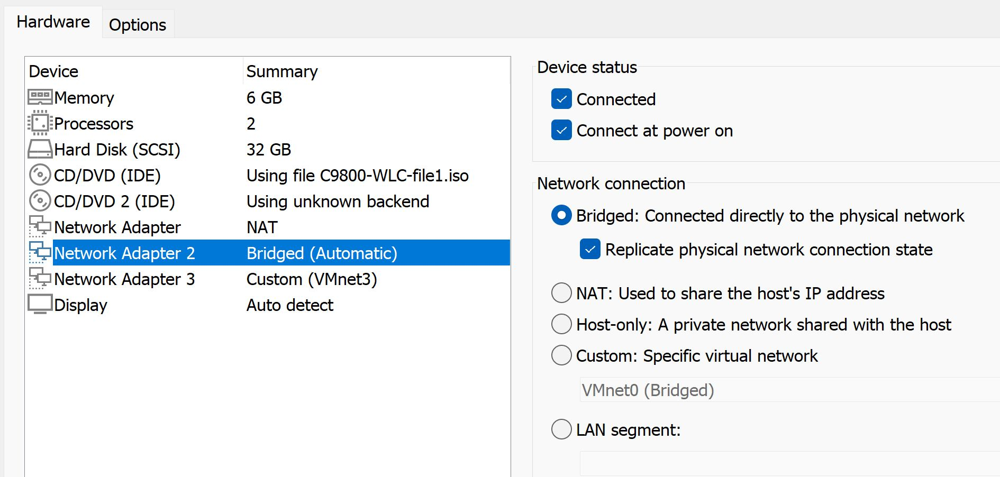

 
 

Confirm the changes by selecting __Ok__, then __Run__ the Virtual Machine

&nbsp;
---
&nbsp;

### 6. Configure the C9800

~~~
conf t
 hostname C9800-WLC
 enable secret pass
 service password-encryption
 no logging cons
 no ip domain lookup
 line vty 0 48
  login local
  transport input all
  exec-timeout 0 0
  exit
 username admin privilege 15 secret C1sc0123
 !
 !
 int vlan 1
  ip add 10.92.1.7 255.255.255.0
  no shut
 int g1
  no switchport
  ip add dhcp
 int g2
  switchport
  switchport mode trunk
  switchport trunk allowed vlan all
 !
 !
 ip route 10.0.0.0 255.0.0.0 10.92.1.4
 ip route 200.0.0.0 255.255.255.0 10.92.1.4
 !
 !
 ntp server 216.239.35.12
 ntp master 4
 ntp source vlan1
 end
~~~

 
 

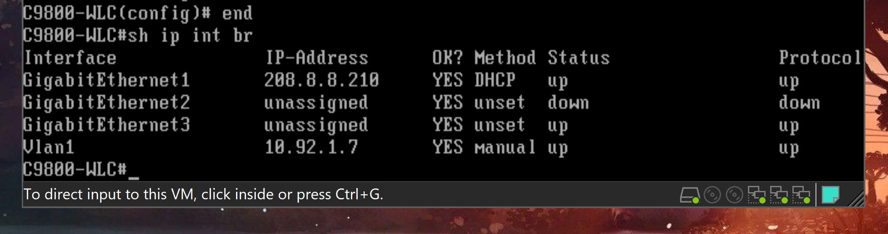

&nbsp;
---
&nbsp;

### 7. Access the GUI of C9800 by using the IP on its GigabitEthernet 1 interface (ex. https://208.8.8.210/)

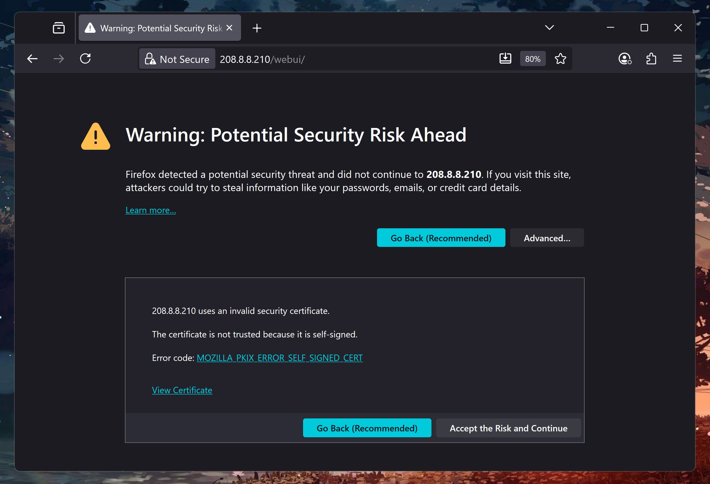

&nbsp;
---
&nbsp;

### 8. Login to the GUI

> Username: admin  
> Password: pass  

 

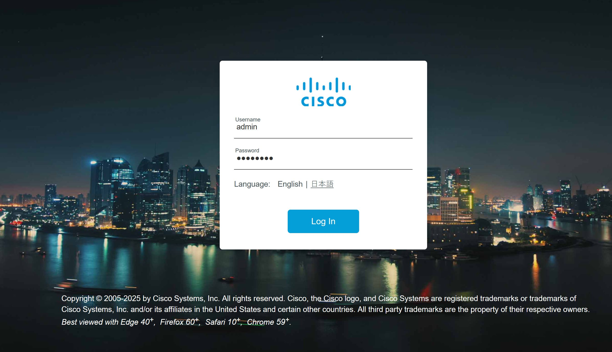

&nbsp;
---
&nbsp;

### 9. Configure the General Settings
Make sure the Country is __US__, and the NTP server is the IP of __time.google.com__

 

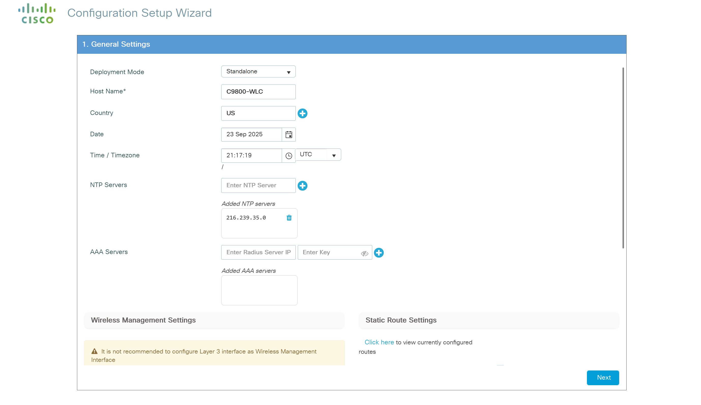

 

For __Wireless Management Settings__, set the management Port Number to __GigabitEthernet2__, which is where we Bridged the connection to the real switch.

<br.

Set the __Wireless Management VLAN__ to __1__

 

The __Wireless Management IP__ is __10.92.1.7__
and the Subnet Mask as __255.255.255.0__

Then __Next__

&nbsp;
---
&nbsp;

### 10. Setup a WLAN (Optional)

 

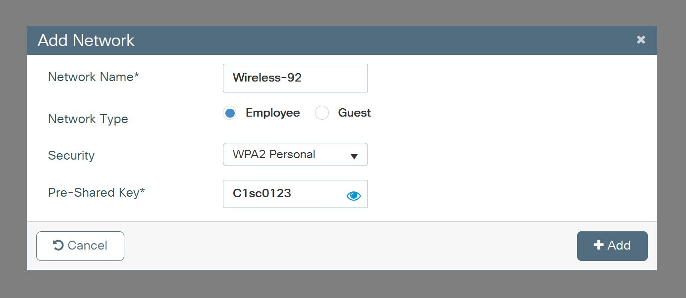

&nbsp;
---
&nbsp;

### 10. Modify Self-Signed Certificates and AP-Group configs

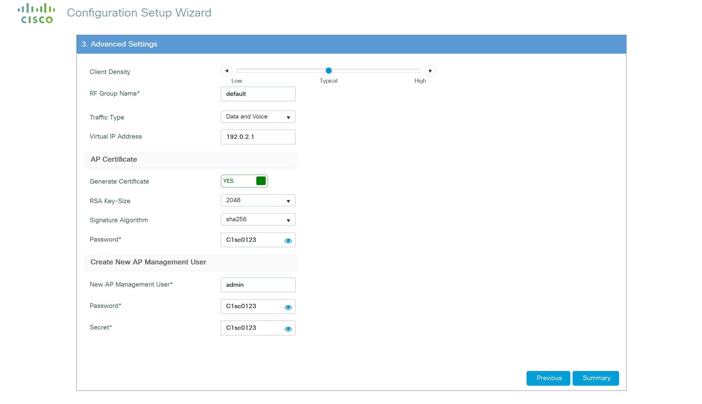

&nbsp;
---
&nbsp;

### 11. Verify configuration summary

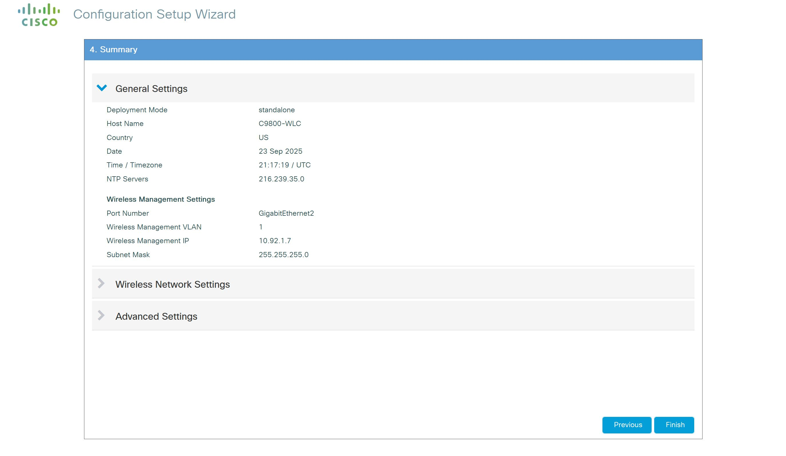

 

Then Apply

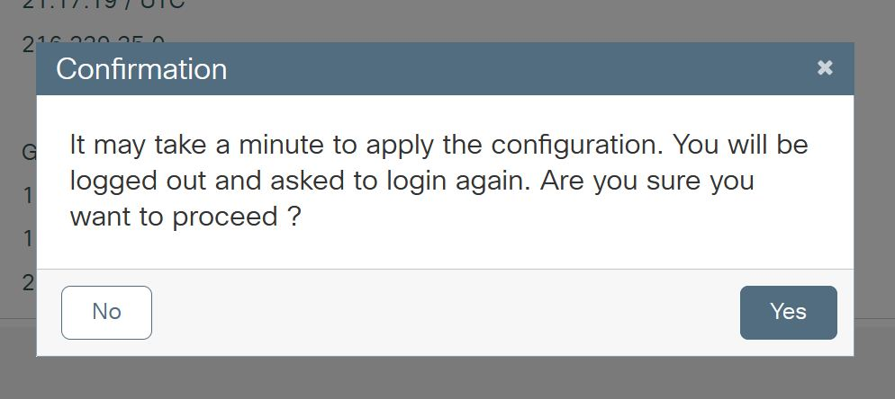

&nbsp;
---
&nbsp;

### 12. Associate self-signed certificate for vwlc-ssc

~~~
conf t
 wireless management interface vlan 1       
 end
wireless config vwlc-ssc key-size 2048 signature-algo sha256 password 0 C1sc0123
~~~

